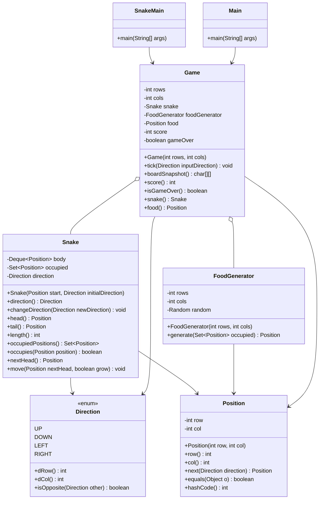

# Snake and Food (Interview-Ready) - LLD Design and Flow

This folder contains a clean, interview-focused Snake game implementation with:
- Correct movement and growth rules
- Wall collision and self-collision handling
- O(1)-friendly snake occupancy checks
- Random food generation on empty cells
- Two runners:
1. `snakefood.SnakeMain` (turn-based input)
2. `snakefood.Main` (real-time tick loop + input thread)

---

## 1. Scope

### Implemented
- Grid-based board (`rows x cols`)
- Snake movement in 4 directions
- 180-degree reverse-direction prevention
- Food consumption and snake growth
- Score tracking (`+1` per food)
- Wall collision detection
- Self-collision detection
- Tail-cell exception handling (valid move when tail shifts in same tick)
- Board snapshot rendering for console UI
- Real-time and turn-based console runners

### Not Implemented
- Obstacles
- Multiple food types
- Wrap-around/no-wall mode
- Pause/resume and speed levels
- Persistent high score

---

## 2. How To Run

From folder:

```bash
cd "D:\Projects\Upskilling\LLD\Practice\Snake and Food"
javac -d . *.java
java snakefood.SnakeMain
```

Real-time mode:

```bash
java snakefood.Main
```

Controls:
- `W` = Up
- `A` = Left
- `S` = Down
- `D` = Right
- `Q` = Quit

---

## 3. High-Level Architecture

The implementation follows a simple layered separation:

1. Presentation/Runner Layer
- `SnakeMain`: turn-based CLI runner
- `Main`: real-time loop + async input

2. Game Orchestration Layer
- `Game`: owns game state and executes one tick safely

3. Domain Layer
- `Snake`: snake body, direction, occupancy tracking
- `FoodGenerator`: generates next food position
- `Position`: immutable coordinate value object
- `Direction`: movement enum with delta and opposite-direction logic

---

## 4. End-to-End Tick Flow

Each call to `Game.tick(inputDirection)` executes:

1. Ignore tick if game already over.
2. Apply input direction if present (`null` means continue current direction).
3. Compute `nextHead`.
4. Check wall bounds.
5. Determine whether food will be eaten.
6. Check self-collision with tail exception:
- moving onto tail is allowed only when tail moves this tick (i.e., not eating).
7. Move snake (`grow` if food eaten).
8. If food eaten:
- increment score
- spawn next food
- if no empty cell exists, mark game over (board full win condition treated as terminal state).

---

## 5. Flow Diagram

```mermaid
flowchart TD
    A[Tick starts] --> B{Game over?}
    B -- Yes --> Z[Return]
    B -- No --> C[Apply input direction if provided]
    C --> D[Compute nextHead]
    D --> E{Out of bounds?}
    E -- Yes --> Y[Set gameOver=true]
    E -- No --> F[Check willEatFood]
    F --> G[Check body collision with tail exception]
    G -- Collision --> Y
    G -- Safe --> H[snake.move(nextHead, willEatFood)]
    H --> I{Ate food?}
    I -- No --> Z
    I -- Yes --> J[score++]
    J --> K[Generate new food]
    K --> L{food == null?}
    L -- Yes --> Y
    L -- No --> Z
```

---

## 6. Class-by-Class Explanation

## `Direction`
File: `Direction.java`

Role:
- Encapsulates movement direction and deltas.

Methods:
1. `dRow()`, `dCol()`
- Returns row/column delta for movement.
2. `isOpposite(Direction other)`
- Prevents illegal 180-degree turns.

Why it exists:
- Removes string-based direction bugs.
- Centralizes directional rules.

---

## `Position`
File: `Position.java`

Role:
- Immutable coordinate value object.

Methods:
1. `row()`, `col()`
- Accessors.
2. `next(Direction direction)`
- Returns next cell based on direction.
3. `equals`, `hashCode`
- Required for correct `HashSet`/`HashMap` behavior.

Why it exists:
- Reliable key type for occupancy set.
- Cleaner than using raw `int[]`.

---

## `Snake`
File: `Snake.java`

Role:
- Owns snake body and direction state.

Core structures:
- `Deque<Position> body`: head at front, tail at end.
- `Set<Position> occupied`: O(1) occupancy/collision check.

Methods:
1. `changeDirection(Direction newDirection)`
- Rejects reverse turns and null.
2. `head()`, `tail()`, `length()`
- Body access helpers.
3. `occupiedPositions()`
- Unmodifiable view for other components.
4. `occupies(Position position)`
- O(1) body membership check.
5. `nextHead()`
- Computes next head from current direction.
6. `move(Position nextHead, boolean grow)`
- Adds new head; removes tail only when not growing.

Why it exists:
- Keeps movement logic away from UI and `Game`.

---

## `FoodGenerator`
File: `FoodGenerator.java`

Role:
- Generates food at random empty positions.

Methods:
1. `generate(Set<Position> occupied)`
- Returns random empty cell.
- Returns `null` when board is full.

Why it exists:
- Isolates spawn policy from game rules.

Tradeoff:
- Current implementation scans full board to build empty list (simple and clear for interview).

---

## `Game`
File: `Game.java`

Role:
- Single source of truth for game state and rules.

State:
- `rows`, `cols`
- `snake`
- `foodGenerator`
- `food`
- `score`
- `gameOver`

Methods:
1. `tick(Direction inputDirection)`
- Main game-step orchestrator.
2. `boardSnapshot()`
- Creates UI-agnostic 2D char state (`H`, `S`, `F`, `.`).
3. `isOutOfBounds(Position position)` (private)
- Boundary validation.
4. Accessors: `score()`, `isGameOver()`, `snake()`, `food()`

Why it exists:
- Encapsulates complete lifecycle and consistency checks.

---

## `SnakeMain` (Turn-based)
File: `SnakeMain.java`

Role:
- Interview-friendly runner where one input drives one tick.

Methods:
1. `main(...)`
- Game loop with prompt-based input.
2. `mapInput(char ch)`
- Maps `W/A/S/D` to `Direction`.
3. `printBoard(Game game)`
- Prints board and score.

Why it exists:
- Easy to debug and explain in interviews.

---

## `Main` (Real-time)
File: `Main.java`

Role:
- Real-time gameplay simulation.

Design:
- One thread reads input into queue.
- Scheduled loop ticks game at fixed interval.

Methods:
1. `main(...)`
- Sets up queue, input thread, scheduler.
2. `readInput(...)`
- Reads keys and posts direction events.
3. `latestDirection(...)`
- Drains queue and applies most recent direction.
4. `printBoard(...)`, `clearConsoleView()`
- Console rendering helpers.

Why it exists:
- Closer to real game experience and demonstrates concurrency basics.

---

## 7. Class Diagram



---

## 8. Design Patterns and Design Choices

1. Value Object Pattern
- `Position` is immutable and equality-safe.

2. Encapsulation + SRP
- `Game` orchestrates rules.
- `Snake` manages body internals.
- `FoodGenerator` handles food placement.
- Runners handle IO only.

3. Queue-based Event Intake (real-time runner)
- Input and game ticks are decoupled.

4. Data Structure Pattern (interview-relevant)
- `Deque` for O(1) head/tail updates.
- `Set` for O(1) occupancy checks.

---

## 9. Time Complexity

Per tick:
- Direction update: `O(1)`
- Next head compute: `O(1)`
- Collision check via set: `O(1)`
- Move update: `O(1)`
- Food generation (current approach): `O(rows * cols)` worst case when food is eaten

Note:
- If asked, you can optimize food generation using a free-cell index structure to get near `O(1)` spawn.

---

## 10. Interview Short Script (30-60 sec)

"I modeled Snake with a `Game` orchestrator, a `Snake` aggregate using `Deque` and `Set`, immutable `Position`, and a separate `FoodGenerator`. Each tick does direction update, next-head calculation, wall/self collision checks, then movement and growth. The tricky correctness case is moving into current tail: I allow it only when the snake is not eating, because tail moves away in that same tick. The design is minimal, testable, and easy to extend with no-wall mode, special foods, or observers."

---

## 11. Suggested Extensions

1. Add `GameStatus` enum (`RUNNING`, `OVER`, `WON`).
2. Add no-wall wrap mode.
3. Add special food types and score multipliers.
4. Add unit tests for:
- reverse-direction guard
- tail exception case
- growth and scoring
- wall/self collision.

