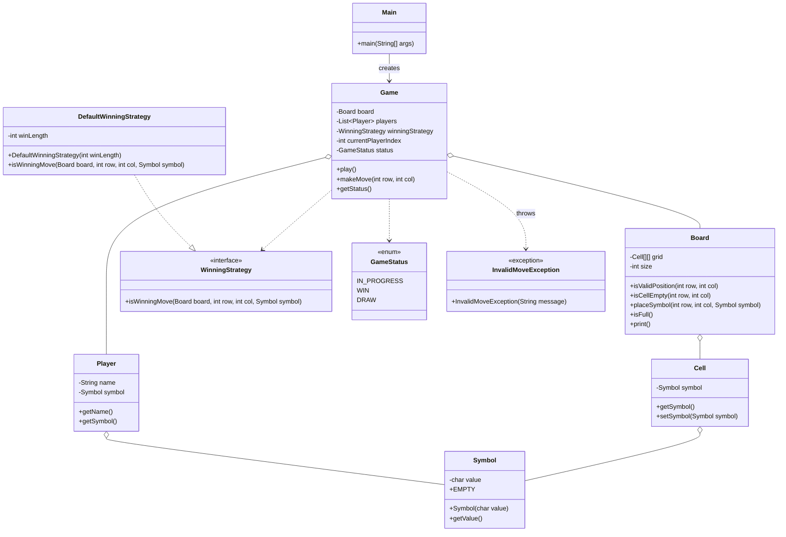
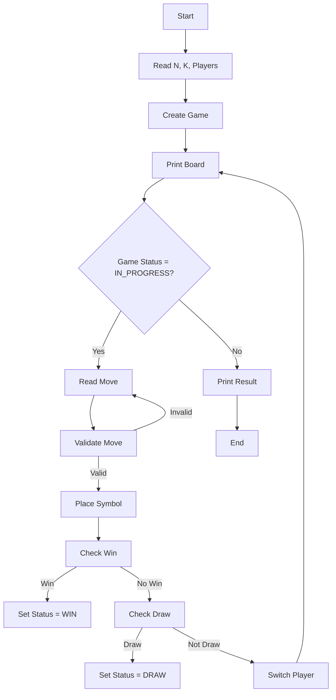

# Tic Tac Toe (Interview-Ready) ? Design & Flow

This folder contains a **simple, interview-friendly** Tic-Tac-Toe implementation that supports:
- Dynamic board size `N`
- Custom win length `K`
- Multiple players with custom symbols

The design is intentionally minimal and close to AlgoMaster?s LLD, with only necessary classes.

---

## Core Classes and Responsibilities

- `Main`
  - Reads user input (board size, win length, players).
  - Creates the `Game` and runs the main loop.

- `Game`
  - Owns the game loop state (current player, status).
  - Validates and applies moves.
  - Checks win or draw after each move.

- `Board`
  - Stores `Cell[][]` grid.
  - Validates positions.
  - Checks if a cell is empty or board is full.
  - Prints board state.

- `Cell`
  - Holds a single `Symbol` (mutable).

- `Symbol`
  - Wraps a character (dynamic symbol support).
  - Includes a static `EMPTY` symbol for unused cells.

- `Player`
  - Holds player name and symbol.

- `WinningStrategy`
  - Strategy interface for checking win.

- `DefaultWinningStrategy`
  - Checks row/column/diagonal sequences around last move.
  - Works for any `N` and `K`.

- `GameStatus`
  - `IN_PROGRESS`, `WIN`, `DRAW`.

- `InvalidMoveException`
  - Thrown for invalid moves.

---

## Class Diagram



---

## Game Flow (Step-by-Step)

1. User inputs:
   - Board size `N`
   - Win length `K`
   - Number of players and their symbols

2. `Main` creates a `Game` with:
   - `Board`
   - `List<Player>`
   - `DefaultWinningStrategy`

3. Game loop:
   - Ask current player for move `(row, col)`
   - Validate move (inside board & empty)
   - Place symbol
   - Check win (`WinningStrategy`)
   - Check draw (board full)
   - Switch to next player

4. End:
   - Print winner or draw

---

## Flow Diagram



---

## Notes for Interviews

- This is **clean and minimal** LLD.
- Supports multiple players and dynamic win length.
- Strategy pattern allows swapping win logic later.
- If asked, you can say:
  - ?I separated Board, Game, and WinningStrategy for clarity and extensibility.?
  - ?Symbols are dynamic so players can choose any character.?

---

## Run

```bash
cd D:\Projects\Upskilling\LLD\Practice\TicTacToa
javac *.java
java Main
```
