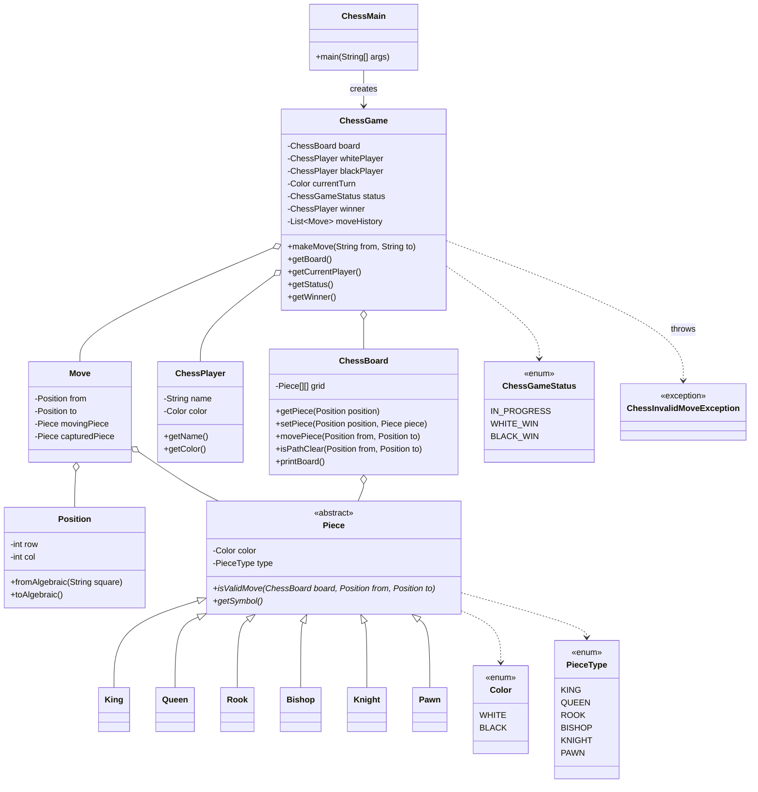

# Chess LLD (Interview Simple)

## Implemented (only core)
- `ChessBoard` (8x8)
- `Piece` hierarchy (`King`, `Queen`, `Rook`, `Bishop`, `Knight`, `Pawn`)
- `ChessGame` with:
  - turn validation
  - movement validation
  - own-piece capture prevention
  - move history
  - game over when a king is captured
- `ChessMain` for console input (`e2 e4`)

## Not included (to keep it simple)
- check/checkmate/stalemate engine
- castling
- en passant
- promotion

## Class Diagram



## Run
From this folder:

```bash
javac *.java
java -cp . ChessMain
```

If you run from project root (`D:\Projects\Upskilling`), use:

```bash
cd "LLD\Practice\chess game"
javac *.java
java -cp . ChessMain
```
