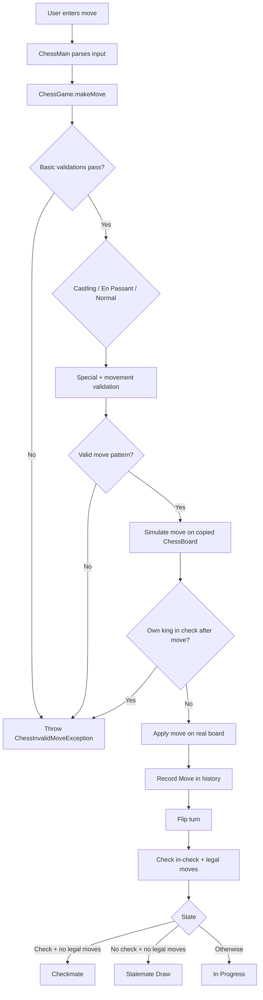
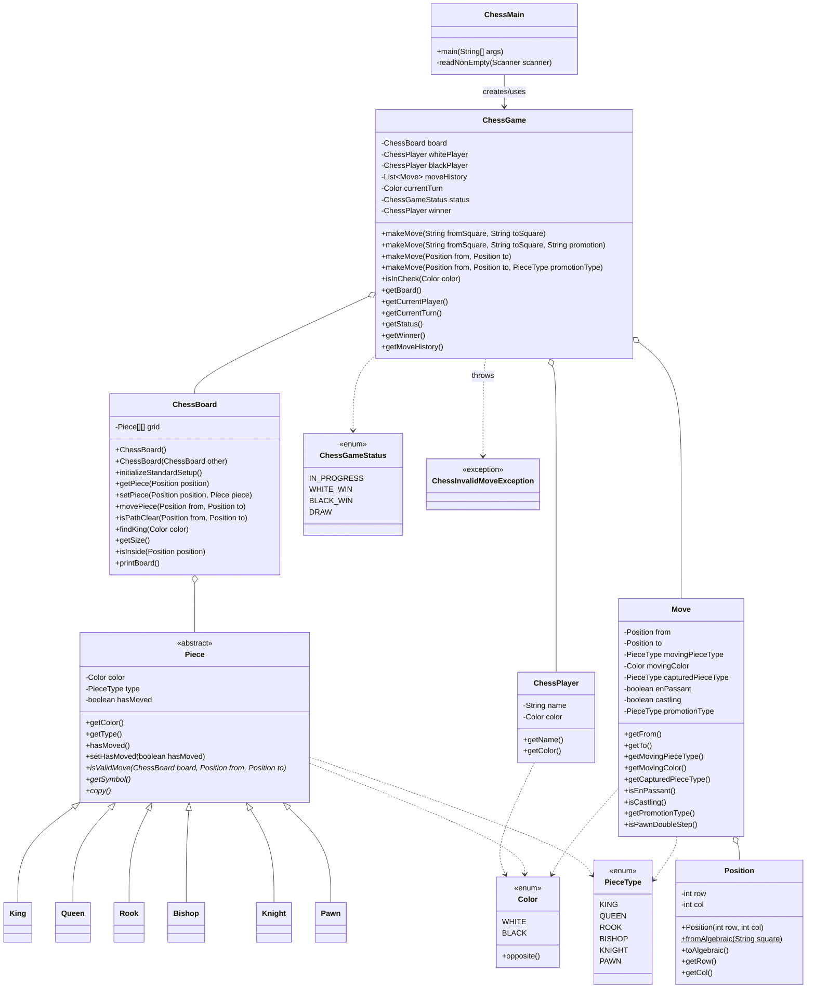

# Chess Game LLD (Interview + Revision Friendly)

This document explains the full Low Level Design and implementation of the console chess game in this folder.

It is written to be:
- interview ready
- easy to revise after a long gap
- accurate to the current code

---

## 1. Scope

### Implemented
- 8x8 board with standard initial setup
- Piece hierarchy with polymorphic movement rules
- Turn management
- Illegal move protection (including own-piece capture)
- Self-check prevention (cannot make a move that leaves your king in check)
- Check detection
- Checkmate detection
- Stalemate detection
- Castling (king/rook unmoved, clear path, not in/through check)
- En passant
- Pawn promotion (default queen, optional `q/r/b/n`)
- Move history

### Not implemented
- Threefold repetition draw
- 50-move rule draw
- Insufficient material draw

---

## 2. How To Run

From this folder:

```bash
javac *.java
java -cp . ChessMain
```

From project root:

```bash
cd "LLD\Practice\chess game"
javac *.java
java -cp . ChessMain
```

Input format:
- Normal move: `e2 e4`
- Promotion: `e7 e8 q`
- Exit: `exit`

---

## 3. High-Level Architecture

The design is split into layers:

1. Presentation Layer
- `ChessMain`: reads input, prints board/messages.

2. Domain/Rule Layer
- `ChessGame`: orchestrates validation, simulation, commit, and game status transitions.

3. State Layer
- `ChessBoard`: board storage and generic board operations.
- `Move`: immutable move history record.
- `Position`: immutable coordinate value object.

4. Behavior Layer
- `Piece` hierarchy: each piece owns its movement logic.

5. Primitive Domain Types
- `Color`, `PieceType`, `ChessGameStatus`, `ChessPlayer`, `ChessInvalidMoveException`.

---

## 4. Complete Move Flow

### 4.1 End-to-end flow (what happens on each move)

1. CLI reads input.
2. `ChessGame.makeMove(...)` parses and validates coordinates.
3. It validates source piece, turn ownership, destination occupancy.
4. It classifies the move:
- castling
- en passant
- normal piece move
5. It validates special rules and promotion constraints.
6. It simulates the move on a copied board.
7. If own king is in check after simulation, move is rejected.
8. It applies move on actual board and records `Move`.
9. It switches turn and evaluates:
- checkmate
- stalemate
- in progress
10. CLI prints updated board and next prompt.

### 4.2 Flow diagram



---

## 5. Class-by-Class Explanation (with methods)

## `ChessMain`
File: `ChessMain.java`

Role:
- Console entrypoint and interaction loop.

Methods:
1. `main(String[] args)`
- Reads player names.
- Creates `ChessGame`.
- Loops until game ends.
- Accepts `from to` and `from to promotion`.
- Handles exceptions and keeps game alive.

2. `readNonEmpty(Scanner scanner)`
- Utility for non-empty player names.

---

## `ChessGame`
File: `ChessGame.java`

Role:
- Rule orchestrator and lifecycle controller.

State:
- `ChessBoard board`
- `ChessPlayer whitePlayer`, `blackPlayer`
- `List<Move> moveHistory`
- `Color currentTurn`
- `ChessGameStatus status`
- `ChessPlayer winner`

Public methods:
1. `ChessGame(String whitePlayerName, String blackPlayerName)`
- Initializes board, players, state.

2. `makeMove(String fromSquare, String toSquare)`
- Convenience overload without explicit promotion.

3. `makeMove(String fromSquare, String toSquare, String promotion)`
- Parses algebraic squares and promotion token.

4. `makeMove(Position from, Position to)`
- Convenience overload.

5. `makeMove(Position from, Position to, PieceType promotionType)`
- Core move pipeline:
- full validation
- special-move handling
- self-check prevention via simulation
- board mutation
- history update
- game-state transition

6. `isInCheck(Color color)`
- Public check query on current board.

7. Getters:
- `getBoard()`
- `getCurrentPlayer()`
- `getCurrentTurn()`
- `getStatus()`
- `getWinner()`
- `getMoveHistory()` (unmodifiable)

Private methods (important internals):
1. `updateGameStateAfterMove()`
- Decides checkmate/stalemate/in-progress.

2. `hasAnyLegalMove(Color color)`
- Brute-force legal move existence check.

3. `isLegalMoveForColor(Position from, Position to, Color color, PieceType promotionType)`
- Non-committing legality checker used by search.

4. `normalizePromotion(Piece piece, Position to, PieceType requestedPromotion)`
- Validates promotion context and defaults to queen.

5. `parsePromotion(String promotion)`
- Maps `q/r/b/n` and long names to `PieceType`.

6. `leavesOwnKingInCheck(...)`
- Performs simulation on copied board.

7. `applyMove(...)`
- Applies castling/en-passant/normal + promotion.

8. `createPromotedPiece(PieceType type, Color color)`
- Factory for promoted piece instances.

9. `isCastlingMove(Piece piece, Position from, Position to)`
- Identifies castling shape.

10. `validateCastling(...)`
- Throws if castling invalid.

11. `isCastlingValid(...)`
- Full castling constraints check.

12. `isEnPassantMove(...)`
- Validates en passant using current board + last move.

13. `getLastMove()`
- Last history event helper.

14. `isInCheck(Color color, ChessBoard targetBoard)`
- Check detection on any board snapshot.

15. `isSquareAttacked(Position target, Color byColor, ChessBoard targetBoard)`
- Attack map query.

16. `canAttackSquare(Piece attacker, Position from, Position target, ChessBoard targetBoard)`
- Piece-specific attack logic (special pawn + king treatment).

---

## `ChessBoard`
File: `ChessBoard.java`

Role:
- Board state container and generic board utilities.

Methods:
1. `ChessBoard()`
- Creates grid and calls standard setup.

2. `ChessBoard(ChessBoard other)`
- Deep-copy constructor used for simulation.

3. `initializeStandardSetup()`
- Places all pieces in default initial chess arrangement.

4. `getPiece(Position position)`
- Safe board read.

5. `setPiece(Position position, Piece piece)`
- Safe board write.

6. `movePiece(Position from, Position to)`
- Moves piece, returns captured piece, updates `hasMoved`.

7. `isPathClear(Position from, Position to)`
- Shared line-traversal utility for sliding pieces.

8. `findKing(Color color)`
- Locates king for check analysis.

9. `getSize()`
- Returns board size (`8`).

10. `isInside(Position position)`
- Board bounds test.

11. `printBoard()`
- Console board renderer.

Private helpers:
- `setupBackRank(Color color, int row)`
- `setupPawns(Color color, int row)`
- `validatePosition(Position position)`

---

## `Piece` (abstract)
File: `Piece.java`

Role:
- Base contract for all piece types.

Fields:
- `Color color`
- `PieceType type`
- `boolean hasMoved` (important for castling and pawn behavior context)

Methods:
1. `getColor()`
2. `getType()`
3. `hasMoved()`
4. `setHasMoved(boolean hasMoved)`
5. `isValidMove(ChessBoard board, Position from, Position to)` (abstract)
6. `getSymbol()` (abstract)
7. `copy()` (abstract, used by board simulation clone)

---

## Piece Implementations

### `King`
File: `King.java`
- `isValidMove(...)`: one-square move in any direction.
- `getSymbol()`: `K/k`.
- `copy()`: clone with color + moved flag.

### `Queen`
File: `Queen.java`
- `isValidMove(...)`: rook or bishop pattern + clear path.
- `getSymbol()`: `Q/q`.
- `copy()`.

### `Rook`
File: `Rook.java`
- `isValidMove(...)`: straight line + clear path.
- `getSymbol()`: `R/r`.
- `copy()`.

### `Bishop`
File: `Bishop.java`
- `isValidMove(...)`: diagonal + clear path.
- `getSymbol()`: `B/b`.
- `copy()`.

### `Knight`
File: `Knight.java`
- `isValidMove(...)`: L-shape.
- `getSymbol()`: `N/n`.
- `copy()`.

### `Pawn`
File: `Pawn.java`
- `isValidMove(...)`:
- forward 1 if empty
- forward 2 from start if clear
- diagonal capture
- `getSymbol()`: `P/p`
- `copy()`

Note:
- En passant is intentionally implemented in `ChessGame` because it depends on move history.

---

## `Move`
File: `Move.java`

Role:
- Immutable move event for history and special-rule checks.

Stored data:
- `from`, `to`
- moving piece type and color
- captured piece type (nullable)
- flags: `enPassant`, `castling`
- `promotionType` (nullable)

Methods:
1. Getters for all fields.
2. `isPawnDoubleStep()`
- critical helper for en passant eligibility.
3. `toString()`
- readable log-like move format.

---

## `Position`
File: `Position.java`

Role:
- Immutable board coordinate value object.

Methods:
1. `Position(int row, int col)`
2. `fromAlgebraic(String square)`
- Converts `a1..h8` into internal `(row,col)`.
3. `toAlgebraic()`
- Converts internal coordinates back to chess notation.
4. `getRow()`, `getCol()`
5. `equals`, `hashCode`, `toString`

Coordinate model:
- Row `0` => rank `8`
- Row `7` => rank `1`

---

## `ChessPlayer`
File: `ChessPlayer.java`

Role:
- Immutable player details.

Methods:
1. Constructor with name validation.
2. `getName()`
3. `getColor()`
4. `toString()`

---

## Enums

### `Color`
File: `Color.java`
- `WHITE`, `BLACK`
- `opposite()` utility

### `PieceType`
File: `PieceType.java`
- `KING`, `QUEEN`, `ROOK`, `BISHOP`, `KNIGHT`, `PAWN`

### `ChessGameStatus`
File: `ChessGameStatus.java`
- `IN_PROGRESS`
- `WHITE_WIN`
- `BLACK_WIN`
- `DRAW`

---

## `ChessInvalidMoveException`
File: `ChessInvalidMoveException.java`

Role:
- Domain-specific runtime exception for illegal moves and invalid rule transitions.

---

## 6. Complete Class Diagram



---

## 7. Design Patterns and Design Choices

1. Strategy via Polymorphism
- `Piece.isValidMove(...)` lets each piece define its own behavior.
- Avoids massive switch-case in `ChessGame`.

2. Orchestrator / Service Pattern
- `ChessGame` centralizes business rules and state transitions.

3. Value Objects
- `Position` is immutable and equality-safe.

4. Immutable Event Record
- `Move` stores historical facts, used by en passant and debugging.

5. Copy-based Simulation
- `ChessBoard(ChessBoard other)` allows safe hypothetical move checks.
- Core to enforcing “no self-check” legality.

6. Encapsulation and Single Responsibility
- Board handles storage/path calculations.
- Pieces handle movement geometry.
- Game handles turn/rule outcomes.
- Main handles IO.

---

## 8. Interview Explanation Script (Short)

If asked to summarize in 30-60 seconds:

"I designed chess with `ChessGame` as the rule engine, `ChessBoard` as state storage, and a polymorphic `Piece` hierarchy for movement logic. Every move follows validate -> simulate -> commit. Simulation on a cloned board guarantees we never allow self-check. Post-move, I compute checkmate/stalemate by asking if the opponent has any legal move. Special rules like castling, en passant, and promotion are implemented in the game service because they depend on global state and move history."

---

## 9. Future Improvements

1. Implement advanced draw rules:
- threefold repetition
- 50-move rule
- insufficient material

2. Add PGN export and algebraic move notation.

3. Add unit tests:
- per piece movement tests
- castling/en passant/promotion scenarios
- checkmate/stalemate regression suite

4. Optional AI layer:
- move generator + minimax/alpha-beta

